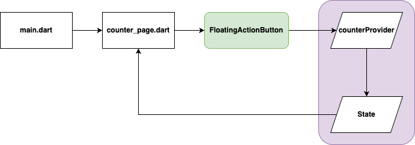

<h1 align="center">
   
  
   
  Pragma
   
</h1>

<h4 align="center">Ejemplo de implementación de patrón de diseño Repository en Flutter</h4>

  
  

Este proyecto forma parte del artefacto asociado a los lineamientos deseables en el uso de Riverpod como manejador de estado y dependencia, en el contexto de Clean Architecture con Flutter. Su implementación requiere un diseño cuidadoso que evite la sobreingeniería y promueva una separación clara entre las capas de presentación, dominio y datos. Para ilustrar su aplicación, se ha desarrollado un caso práctico enfocado en la consulta de países, donde Riverpod facilita la creación de providers que permiten inyectar dependencias y manejar el estado de forma reactiva, desacoplando la lógica de negocio del origen de los datos.

A continuación, se presenta el diagrama del proyecto, centrado en la estructura y responsabilidades que conforman la implementación basada en Riverpod.

  <a href="#topicos">Topicos</a> •
  <a href="#instalación-y-ejecución">Instalación y ejecución</a> •
  <a href="#consideraciones">Consideraciones</a> •
  <a href="#tecnologias">Tecnologías</a> •
  <a href="#credits">Autores</a> •
  <a href="#related">Relacionados</a>

## Topicos

* Flutter
* Dart
* Bridge Pattern

## Instalación y ejecución

Para clonar y ejecutar está aplicación, necesitas [Git](https://git-scm.com) y [Flutter SDK](https://docs.flutter.dev/get-started/install) instalados en tu equipo. Una vez clonado el repositorio, tu IDE te recomendará hacer `flutter pub get`, una vez obtenidas las dependencias necesarias del proyecto mendiante el anterior comando. Podemos compilar el proyecto ya sea en el navegador, emulador, simulador o dispositivo físico.

## Consideraciones
Para tomar una decisión informada sobre el uso de Riverpod como herramienta de gestión de estado y dependencias dentro del enfoque de Clean Architecture, es clave considerar varios aspectos que garanticen una solución limpia, mantenible y adaptable al cambio. A continuación, se destacan los puntos principales a tener en cuenta:

1. **Separación de responsabilidades y desacoplamiento**
- Riverpod permite desacoplar de forma efectiva la lógica de negocio de la fuente de datos mediante el uso de providers, facilitando que los casos de uso operen sobre abstracciones, sin depender directamente de implementaciones concretas.

2. **Extensibilidad y escalabilidad del sistema**
- Gracias a su enfoque modular, Riverpod facilita la incorporación de nuevas fuentes de datos o reglas de negocio sin modificar el código existente, lo cual favorece la evolución del sistema con bajo impacto.

3. **Alineación con principios SOLID**
- Fomenta el Principio de Inversión de Dependencias (DIP) al permitir que las capas superiores dependan de providers (interfaces o factories), no de implementaciones directas. También se alinea con el Principio de Abierto/Cerrado (OCP), permitiendo introducir nuevos comportamientos sin alterar la lógica ya construida.

4. **Mantenibilidad y pruebas**
- El uso de providers facilita el aislamiento de dependencias y la inyección de valores personalizados en entornos de prueba, lo que permite escribir pruebas unitarias confiables y mantener el código más limpio y modular.

5. **Simplicidad estructural y bajo acoplamiento**
- A diferencia de otros enfoques más complejos, Riverpod introduce una capa de gestión de estado ligera y flexible que se adapta bien tanto a aplicaciones pequeñas como a arquitecturas más robustas, sin imponer estructuras rígidas.

## Tecnologías
-   [Flutter](https://flutter.dev/)
-   [Dart](https://dart.dev/)

## Autores

| [ Jorge Mogotocoro](https://github.com/jmogotoc)   | 
:------------------------------------------------------------------------------------------------------------------------------------------------------------------------------:|

## Relacionados

- Los manejadores de estado como Riverpod ofrecen soluciones estructuradas a problemas comunes en el desarrollo de aplicaciones Flutter, especialmente relacionados con la gestión de datos, la reactividad y la inyección de dependencias. Funcionan como herramientas reutilizables y adaptables que permiten organizar mejor el código, mejorar la escalabilidad y facilitar el mantenimiento. Para profundizar en su uso y beneficios, recomendamos visitar el siguiente [enlace](https://riverpod.dev/es/docs/introduction/getting_started).